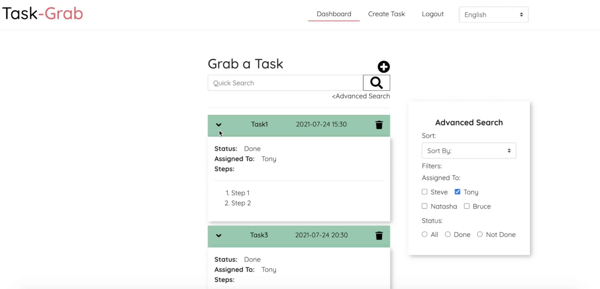
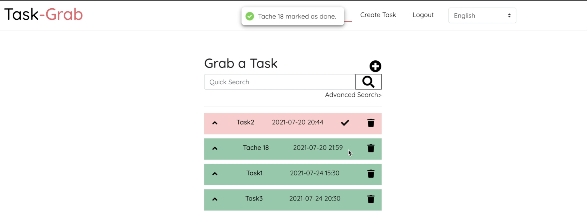
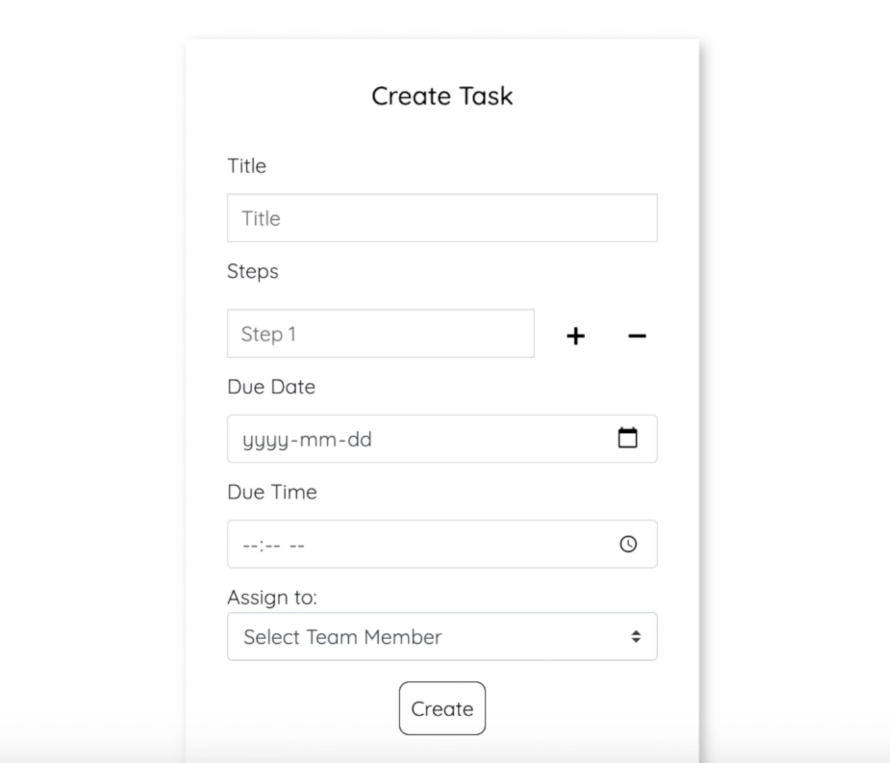
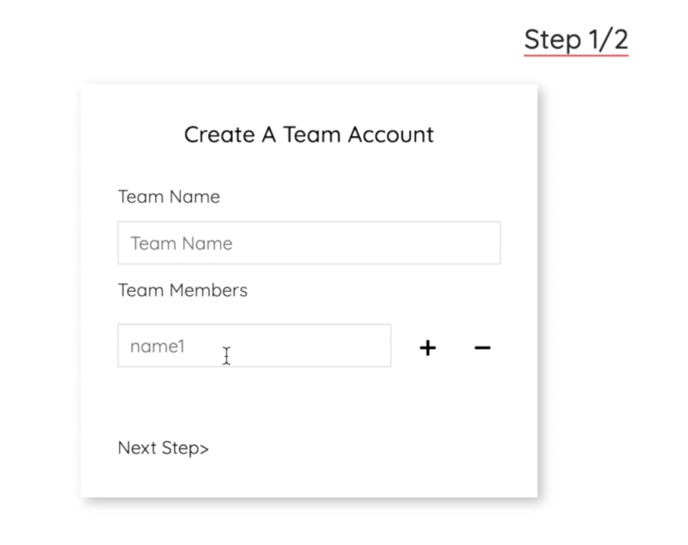

## React App : Task-Grab

## Scripts

In the project directory, you can run:
### `npm run jsonServer`

Runs the json server data watcher where I store dummy data for the App
Open [http://localhost:8000](http://localhost:8000) to view it in the browser.

### `npm start`

Runs the app in development mode.\
Open [http://localhost:3000](http://localhost:3000) to view it in the browser.

The page will reload if you make edits.\
You will also see any lint errors in the console.

### Dependencies

- React-Router-dom
- React-icons
- React-i18next
- React-hot-toaster
- Json-server
