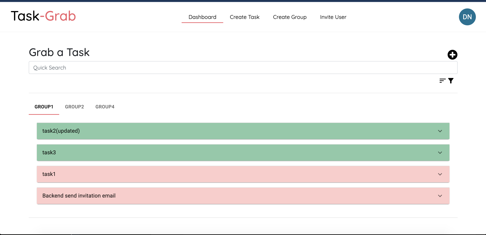
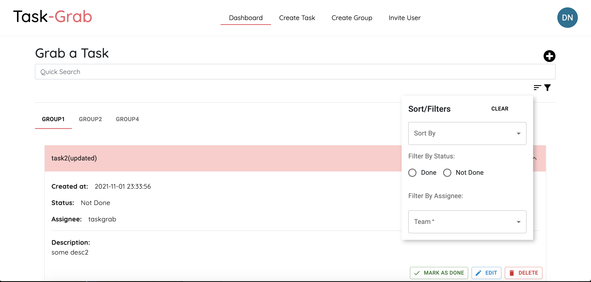
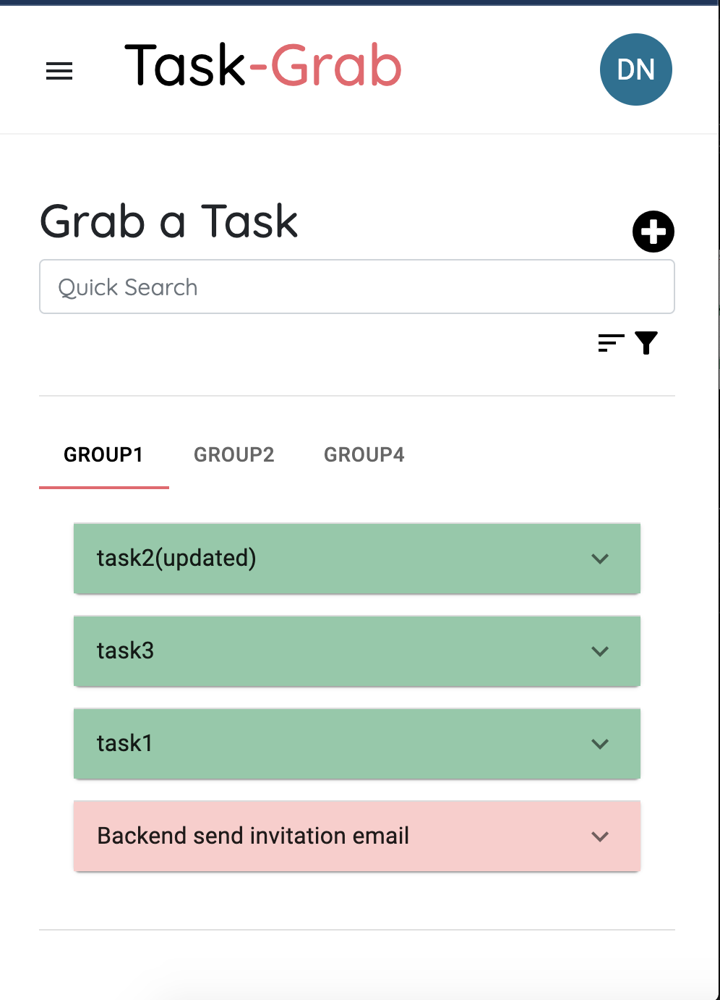
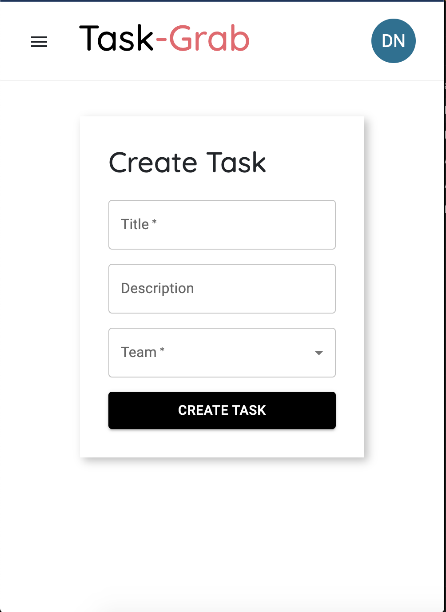

## Task-Grab

## Scripts

### Frontend

#### `npm start`

Runs the react app in development mode.
Open [http://localhost:3000](http://localhost:3000) to view it in the browser.

The page will reload if you make edits.\
You will also see any lint errors in the console.

### Dependencies

- React-Router-dom
- React-icons
- React-i18next
- React-hot-toaster

### Backend

#### `pip install -r requirements.txt`

- Install all dependencies for backend

#### `python manage.py runserver`

Runs Django backend in development mode.

### Dependencies
 
- Listed in requirements.txt file in backend directory
