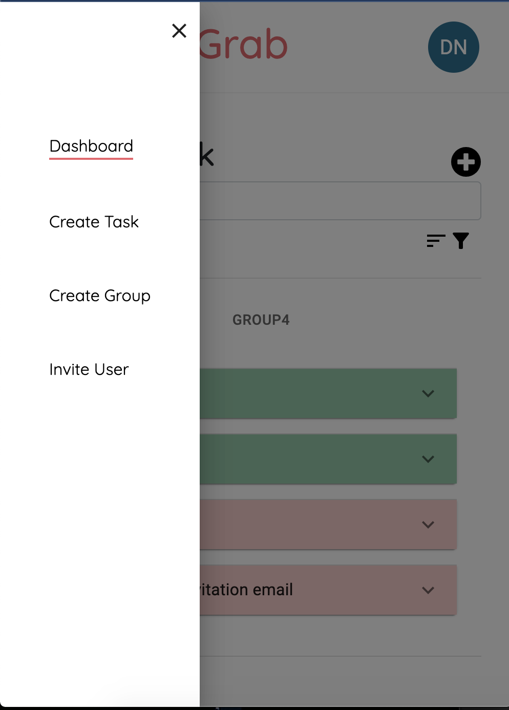

## Task-Grab

Task Manager full stack application for group project management
## Features
- CRUD operations on tasks
- user authentication
- create user groups
- invite new user by email
- searching, sort and filtering tasks by assignee or status
## Screenshots

## CMDS

### Frontend

#### `npm install`

- Install all frontend dependecies listed in package.json

#### `npm start`

- Runs React frontend in development mode on port 3000

### Backend

#### `pip install -r requirements.txt`

- Install all dependencies for backend from requirements.txt file

#### `python manage.py runserver`

- Runs Django backend in development mode on port 8000

